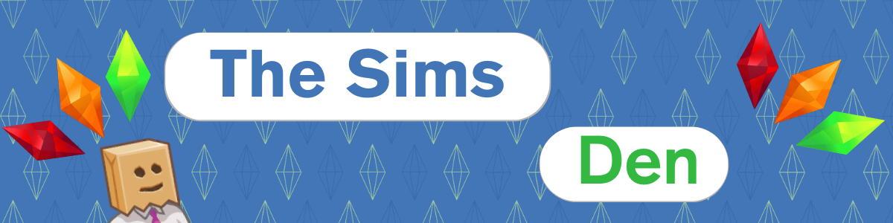
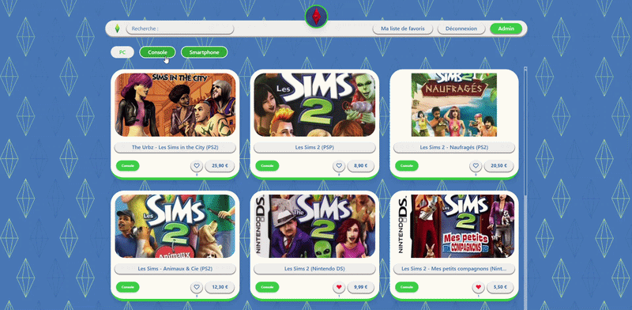
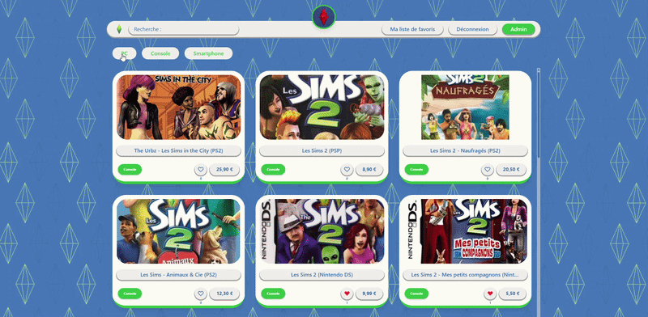
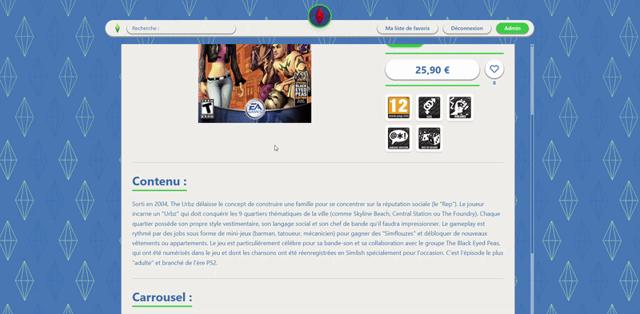
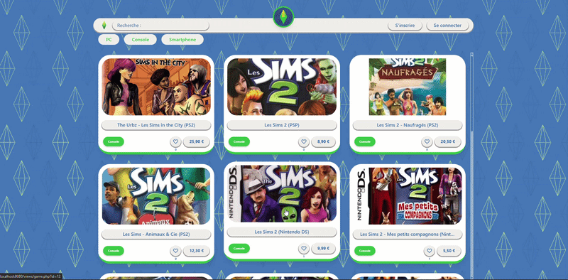
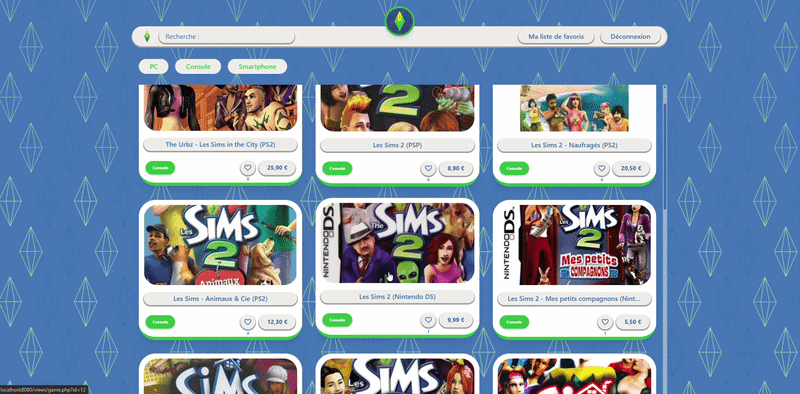
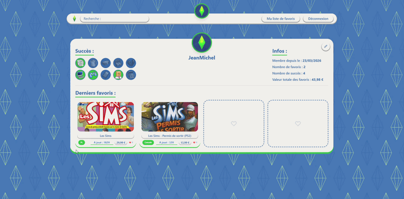
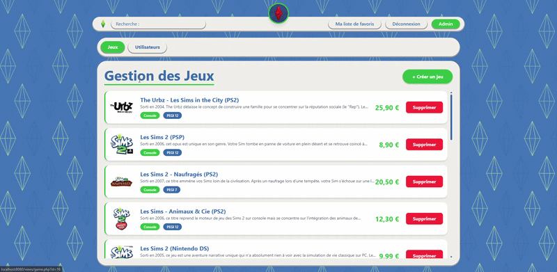

<p align="center">
  
</p>

---

## 📖 Table of Contents

1. [🤔 What is The Sims Den?](#-what-is-the-sims-den)
2. [🖼️ Demo](#-demo)
3. [🛠️ Technologies](#️-technologies)
4. [🚀 Installation](#-installation)
   1. [🧰 Prerequisites](#-prerequisites)
   2. [📥 Clone the Project](#-clone-the-project)
   3. [▶️ Run the Project](#️-run-the-project)
   4. [🗄️ SQLite Database](#️-sqlite-database)
5. [🗂️ File Architecture](#️-file-architecture)
6. [🔑 Demo Account](#-demo-account)
7. [✨ Features](#-features)
   1. [🎮 Game Catalog and Filters](#-game-catalog-and-filters)
   2. [🧾 Detailed Game Page](#-detailed-game-page)
   3. [🔐 Authentication](#-authentication)
   4. [❤️ Favorites with Playtime](#️-favorites-with-playtime)
   5. [👤 Profile and Achievements](#-profile-and-achievements)
   6. [🛡️ Admin Dashboard](#️-admin-dashboard)
8. [🌐 Credits](#-credits)
9. [📎 Appendix](#-appendix)

## 🤔 What is The Sims Den?

**The Sims Den** is a PHP web application inspired by *The Sims* universe, built to browse games, manage favorites, and track a personal collection.

The project includes:
- a public area (catalog and game details),
- a user area (authentication, profile, favorites, achievements),
- an admin area (game and user management),
- an SQLite database with relational constraints (ex: ``user_achievement`` and ``user_favorite``).

## 🖼️ Demo
<div align="center">
  
</div>

## 🛠️ Technologies

- **Backend**: PHP 8+
- **Database**: SQLite (`database/theSimsDen.sqli`)
- **Frontend**: HTML, TailwindCSS, JavaScript
- **Backend Architecture**: `Model / Repository / Service / Security / Enum`

## 🚀 Installation

### 🧰 Prerequisites

[](https://git-scm.com/downloads)
[](https://www.php.net/downloads.php)

Recommended PHP config (`php.ini`):

```ini
# To support the image upload,
# ensure these settings are configured to avoid upload errors
upload_max_filesize = 10M
post_max_size = 50M
max_file_uploads = 20
```

### 📥 Clone the Project

```bash
git clone https://github.com/Ewoukouskous/B2-PHP-the_sims_den.git
cd B2-PHP-the_sims_den
```

### ▶️ Run the Project

From the project root run this command to start the built-in PHP server:

```bash
# Ensure you have the PHP binary in your PATH, then run
php -S localhost:8080 -t public
```

Then open:

```text
http://localhost:8080
```

### 🗄️ SQLite Database

The app points use this .sqli file:

```text
database/theSimsDen.sqli
```

You can:
- use this existing database directly,
- or recreate a fresh one with scripts in `database/creationTableScripts/` and populate data from `database/baseInsertScripts/`.

## 🗂️ File Architecture

```txt
B2-PHP-the_sims_den/
├── database/
│   ├── creationTableScripts/
│   ├── baseInsertScripts/
│   └── theSimsDen.sqli
├── public/
│   ├── admin/
│   ├── auth/
│   ├── actions/
│   ├── views/
│   ├── includes/
│   ├── js/
│   ├── img/
│   └── sounds/
└── src/
    ├── Database/
    ├── Enum/
    ├── Model/
    ├── Repository/
    ├── Security/
    └── Service/
```

## 🔑 Demo Account

Provided script: `database/baseInsertScripts/insert_admin_user.sql`

- **Admin**: `admin`
- **Password**: `admin123`
- **Email**: `admin@thesimden.com`

> ⚠️**Change the admin password as soon as possible to ensure that the account is secure**⚠️

## ✨ Features

### 🎮 Game Catalog and Filters

- Game grid on the homepage (`public/index.php`)
- Platform filters: **PC / Console / Smartphone** (`public/js/filters.js`)
- Header search input (`public/includes/header.php`)

<div align="center">
  
</div>

### 🧾 Detailed Game Page

- Hero image, thumbnail, price, type, and PEGI age
- PEGI content descriptors (violence, language, etc.)
- Media carousel (`public/views/game.php`)

<div align="center">
  
</div>

### 🔐 Authentication

- Login (`public/auth/login.php`)
- Registration (`public/auth/register.php`)
- Secure logout (`public/auth/logout.php`)
- Session/role middleware (`src/Security/AuthMiddleware.php`)

<div align="center">
  
</div>

### ❤️ Favorites with Playtime

- Add/remove favorites (`public/actions/favorite.php`)
- On add, a modal asks for played hours (`public/js/favoriteForm.js`)
- Dedicated favorites list (`public/views/favoriteList.php`)

<div align="center">
  
</div>

### 👤 Profile and Achievements

- User profile: avatar, stats, and recent favorites
- Profile editing (username, email, password, avatar)
- Achievement system (toasts + conditional unlock)
- `motherlode` cheat code unlock (`public/js/cheatCode.js`)

<div align="center">
  
</div>

### 🛡️ Admin Dashboard

- **Games** tab: list, delete
  - Create game with hero/title upload + gallery (max 6) + PEGI (`public/admin/gameDashboard.php`)

- **Users** tab: inspect, change role, delete

<div align="center">
  
</div>


## 🌐 Credits

- [@Amiard Renaud](https://github.com/Ramiard)
- [@Lefebvre Nino](https://github.com/Ewoukouskous)


## 📎 Appendix

- 🪢[Database Schema](https://drawsql.app/teams/ynov-41/diagrams/php-sims)
- 🗃️[Github Repository](https://github.com/Ewoukouskous/B2-PHP-the_sims_den.git)


